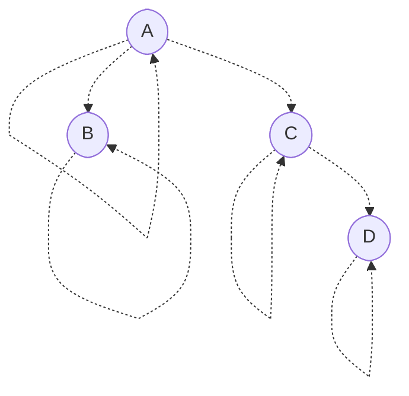
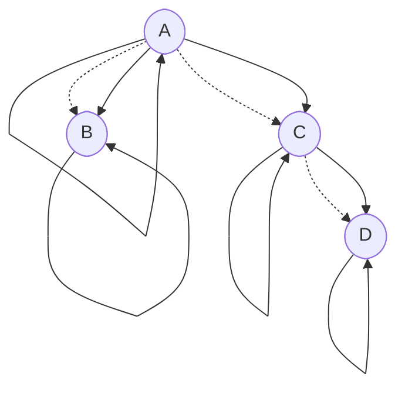
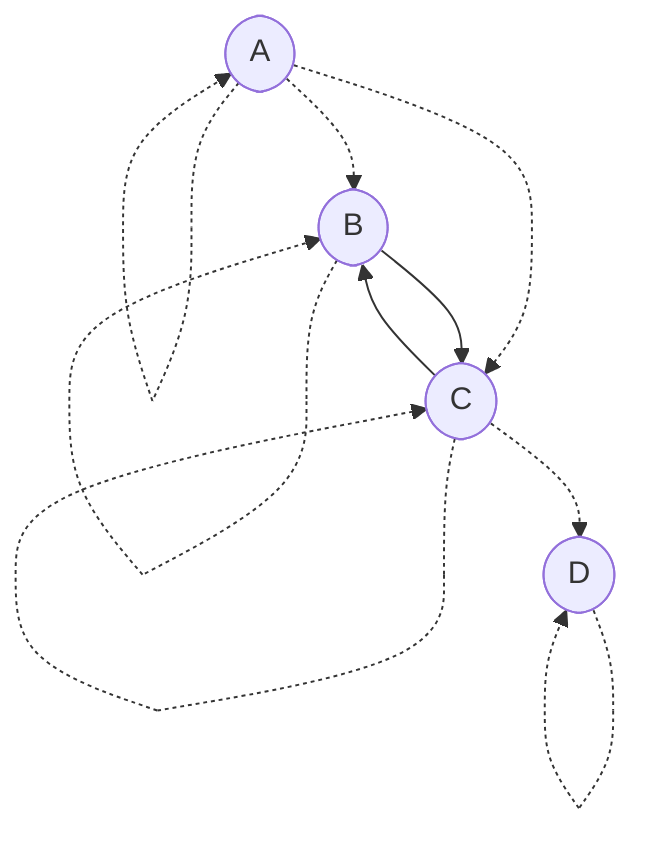
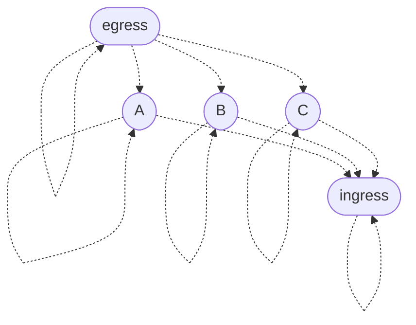
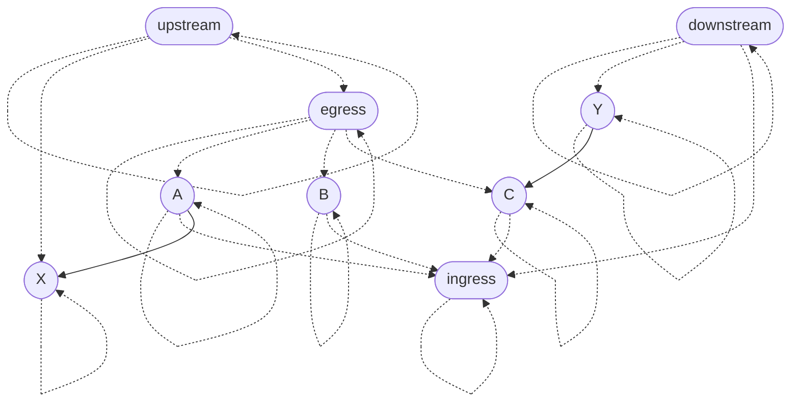
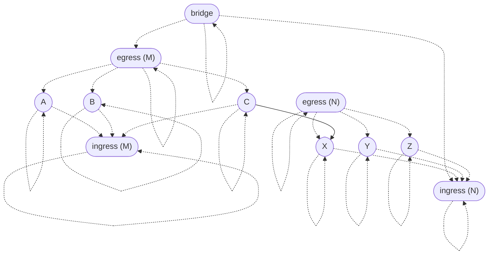
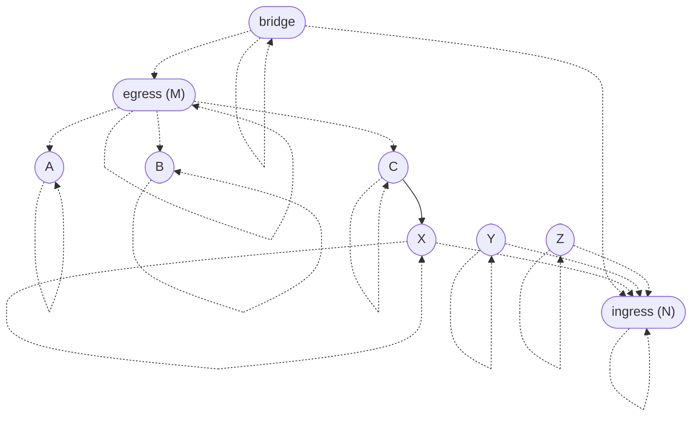
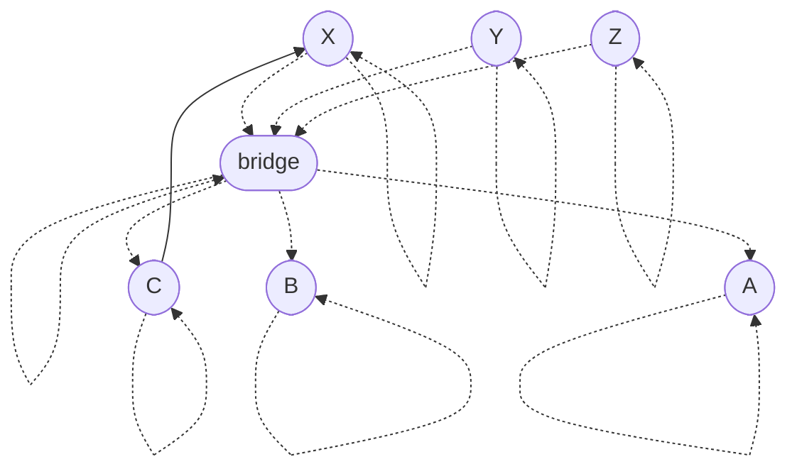

# Admissibility graphs

The theory of *admissibility graphs* is a mathematical framework for specifying encapsulation boundaries in a system. This directory contains a formalization of the concept and [mechanized proofs](https://en.wikipedia.org/wiki/Proof_assistant) of some basic theorems about it. Below is an informal introduction to the idea. I hope you find it interesting!

## Motivation

Imagine a sorting program that reads in some lines of text and prints them out in lexicographical order. A [static call graph](https://en.wikipedia.org/wiki/Call_graph) for that program would show how the functions in the program depend on each other:


For encapsulation purposes, we may wish to decree that `partition` is an implementation detail of `quicksort` and should not be called from any other function. In other words, we want to forbid any edges to `partition` in the call graph except the one from `quicksort`. How should a programmer express a policy like that?

Of course, most programming languages already have a mechanism for encapsulation—if not several! For example, [scoping](https://en.wikipedia.org/wiki/Scope_\(computer_science\)) allows a programmer to write local definitions which are only accessible to part of the program. Object-oriented programmers may also think of [access modifiers](https://docs.oracle.com/javase/tutorial/java/javaOO/accesscontrol.html) like `public`, `private`, and `protected`, or the concept of "[friend classes](https://en.cppreference.com/w/cpp/language/friend)" in C++. Functional programmers may think of [module systems](https://jozefg.bitbucket.io/posts/2015-01-08-modules.html) or [existential quantification](https://groups.seas.harvard.edu/courses/cs152/2014sp/lectures/lec17-existential.pdf).

Those language features are specific types of encapsulation. In this tutorial, I'll introduce a general framework called *admissibility graphs* which can be used to model encapsulation in many different contexts. For example, a cloud computing provider might consider using admissibility graphs as a form of [identity and access management](https://en.wikipedia.org/wiki/Identity_management). A network engineer might use an admissibility graph to specify firewall policies. Or, a document collaboration application might use admissibility graphs to represent sharing and editing permissions.

## Definition

Before we look at any particular admissibility graphs, allow me to first define the general concept.

### Data

An admissibility graph, like any [graph](https://en.wikipedia.org/wiki/Graph_\(discrete_mathematics\)), has a set of **nodes**. The nodes might represent entities such as functions in a program or microservices in a distributed system.

Admissibility graphs have two types of directed edges which are understood as [binary relations](https://en.wikipedia.org/wiki/Binary_relation) on nodes:

- **Dependencies** are the main edges of the graph. For example, dependencies might indicate functions calling other functions or microservices making RPCs to other microservices. A node can depend on multiple *target* nodes and be depended on by multiple *source* nodes. A dependency is depicted as a solid arrow from the source to the target.

  ```mermaid
  ---
  title: Dependency
  ---
  flowchart LR
    source([source])
    target([target])

    source --> target
  ```
- **Parent-child relationships** indicate when nodes are considered implementation details of other nodes. A node can have multiple *parent* nodes and multiple *child* nodes. A parent-child relationship is depicted as a dotted arrow from the parent to the child.

  ```mermaid
  ---
  title: Parent-child relationship
  ---
  flowchart LR
    parent([parent])
    child([child])

    parent -.-> child
  ```

### Ancestry and admissibility

Before we can state the axioms, we must first define *ancestry* and *admissibility*.

- *Ancestry* is the [transitive closure](https://en.wikipedia.org/wiki/Transitive_closure) of the parent-child relation. We'll postulate below that the parent-child relation is [reflexive](https://en.wikipedia.org/wiki/Reflexive_relation), so ancestry is reflexive as well. All told, `A` is an *ancestor* of `D` (`D` is a *descendant* of `A`) when there is a path from `A` to `D` consisting of parent-child relationships oriented parent-to-child.
- A node `T` *admits* a node `S` (`S` is *admitted by* `T`) when there is an ancestor `A` of `S` and a descendant `D` of `T` such that `A` is a parent of `D` (`D` is a child of `A`). A dependency is *admissible* when its target admits its source. Admissibility might seem mysterious at first, but we'll come to understand it through examples below.

### Axioms

Admissibility graphs are required to satisfy three mathematical laws:

- **Axiom (parent-child reflexivity).** Every node is a parent of itself.
- **Axiom (ancestor antisymmetry).** If two nodes are ancestors of each other, then they're the same node.
- **Axiom (dependency admissibility).** Every dependency is admissible.

## Examples

To explore the consequences of the axioms and build intuition for them, let's look at some examples. You're invited to independently verify whether the graphs below agree with the axioms or violate them in some way.

### Admissibility basics

Let's start with the following admissibility graph, which has some parent-child relationships but no dependencies.



We should check that the reflexivity and antisymmetry axioms are satisfied.

- Every node is a parent (and child) of itself, per reflexivity. This can be interpreted as saying that every node is an implementation detail of itself. That may seem like a philosophical position, but we'll see [later](#special-cases-of-admissibility) that it has important practical consequences.
- Antisymmetry says there are no ancestry cycles. In this example, `A` is an ancestor of `D`, so `D` can't be an ancestor of `A`. The motivation for antisymmetry will become clear [below](#the-module-pattern).

Now let's consider admissibility. In this example, `B` and `C` are considered implementation details of `A`, and `D` is an implementation detail of `C`. What dependencies could we add to this graph?

A node should be able to depend on its implementation details. So, for every parent-child relationship, we can add a dependency on the child by the parent.



Furthermore, since `B` and `C` are both part of the implementation of `A`, they can depend on each other.



Since `C` is allowed to depend on `B`, the implementation of `C` should be allowed to depend on `B` as well. So `D` is allowed to depend on `B`.


However, neither `A` nor `B` can depend on `D`, since `D` is an implementation detail of `C`.


### The module pattern

We'd like to be able to group nodes together and treat them as a single unit from an admissibility perspective.

If we didn't have the antisymmetry axiom, we might try to arrange them in an ancestry cycle:


This would accomplish the goal, however it has a crucial limitation. Suppose `A`, `B`, and `C` have implementation details `_A`, `_B`, and `_C`, respectively.


The problem with this architecture is that the internal nodes `_A`, `_B`, and `_C` admit every node in the graph! Ancestry cycles are incompatible with encapsulation, so the antisymmetry axiom rules them out.

But what should we do instead? We can use the *module pattern*. We introduce auxiliary gateway nodes to manage ingress and egress, and we configure them as follows:



Then the ingress node can be placed in contexts where we want to allow external ndoes to depend on the contents of the module, and the egress node can be placed in contexts where we want the contents of the module to depend on external nodes.



In this example, the external node `X` is a sibling of the egress node of the module, so module member `A` can depend on it. The external node `Y` is a sibling of the ingress node of the module, so it can depend on module member `C`.

It's natural to wonder whether a single node could serve as both the ingress and egress gateways for the same module. However, that would violate antisymmetry.

If we want to allow the contents of one module to depend on the contents of another, we can put the egress node of the former and the ingress node of the latter in a shared context.



In this example, the contents of module `M` can depend on the contents of module `N` (as demonstrated by the dependency on `X` by `C`), but not vice versa. Mutual admissibility can be arranged by also bridging the ingress of `M` and the egress of `N`. In general, arbitrary admissibility relationships between modules can be configured by bridging the relevant gateways.

Since we aren't using the ingress of `M` or the egress of `N`, we can simply delete them.



However, if you might need them in the future, you will have to add many parent-child relationships when you reintroduce them. So it may be better to leave the gateways in, even if you don't need them right away.

We might try to simplify the graph as follows:



Although this is a valid admissibility graph, it's probably not what you want. This graph would allow `A`, `B`, and `C` to depend on the implementation details of `X`, `Y`, and `Z` (if there were any).

## Special cases of admissibility

The admissibility axiom states that the target of a dependency must be an ancestor of a child of an ancestor of the source. In this section, we consider two common special cases of that criterion.

### Ancestors of children

A consequence of the admissibility axiom is that *a node is admitted by any ancestors of its children*. From this, we can draw many conclusions:

- A node is admitted by its own children.
- A node is admitted by parents of its children, including itself.
- A node is admitted by grandparents of its children, including its own parents.
- …
- A node is admitted by its own ancestors.

The second conclusion would seem to imply that admissibility is reflexive, which might make one wonder why the reflexivity axiom is needed. The complication is that this conclusion only follows when the node has children. The reflexivity axiom says it doesn't matter—every node has at least one child (itself).

### Children of ancestors

Another consequence of the admissibility axiom is that *a node is admitted by any children of its ancestors*. From this, we can also draw many conclusions, including some we've already seen:

- A node is admitted by its own children.
- A node is admitted by children of its parents (siblings), including itself.
- A node is admitted by children of its grandparents ([piblings](https://www.dictionary.com/e/aunt-uncle-niece-nephew-words/)), including its own parents.
- …
- A node is admitted by its own ancestors.

As before, the second conclusion seems to imply that admissibility is reflexive, but that only follows when the node has parents. The reflexivity axiom says it doesn't matter—every node has at least one parent (itself).
