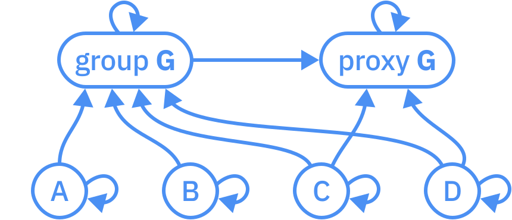
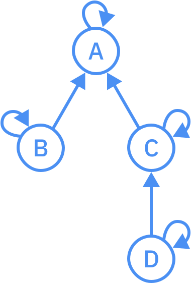
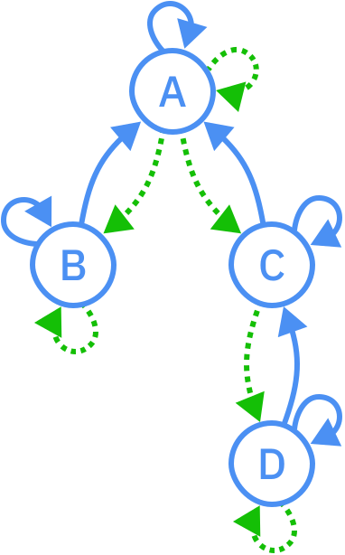
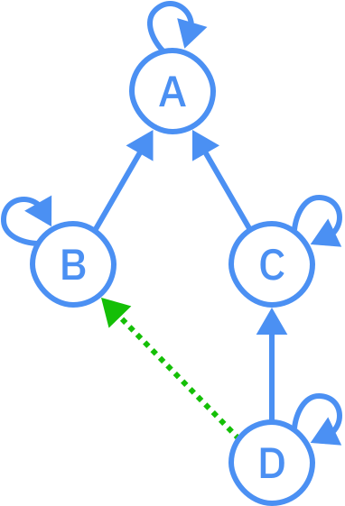
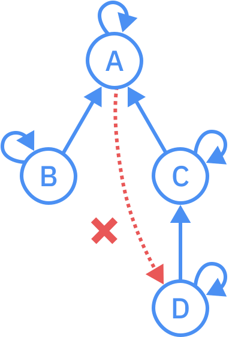
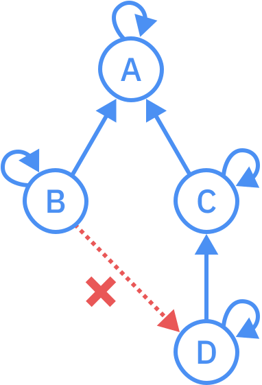
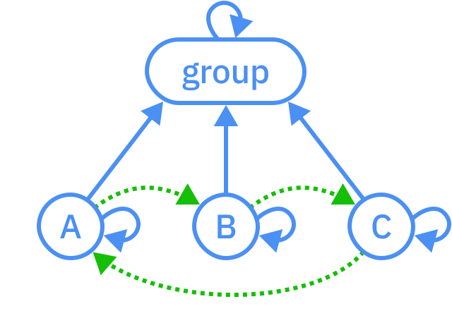
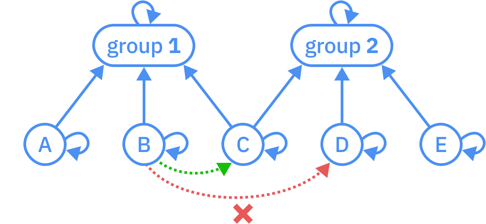
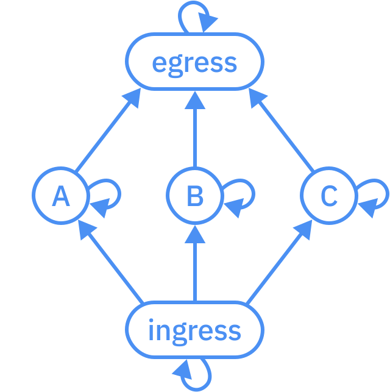
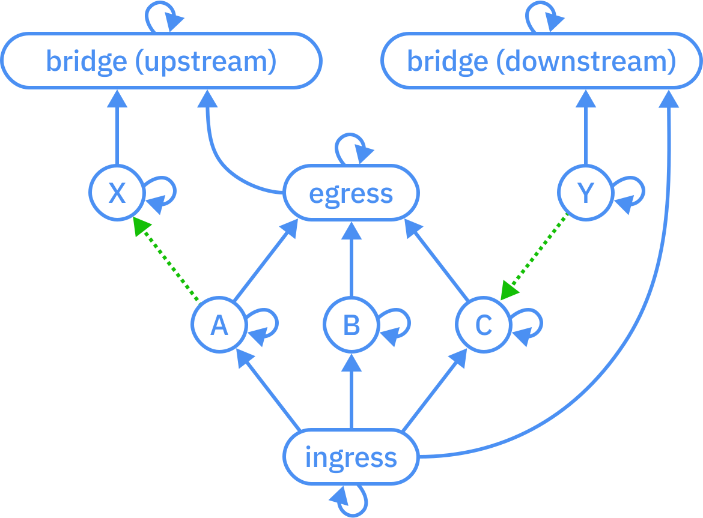

# Admissibility graphs

Most programming languages have some support for [encapsulation](https://en.wikipedia.org/wiki/Encapsulation_\(computer_programming\)), such as [access modifiers](https://en.wikipedia.org/wiki/Access_modifiers) (`public`, `private`, etc.), [module systems](https://courses.cs.washington.edu/courses/cse341/04wi/lectures/09-ml-modules.html), [existential types](https://groups.seas.harvard.edu/courses/cs152/2014sp/lectures/lec17-existential.pdf), or [closures](https://en.wikipedia.org/wiki/Closure_\(computer_programming\)). Encapsulation is a versatile concept in system design and isn't limited to just programming language features. For example, in a microservices architecture, it's common for a service to have its own database, with all access to that data being mediated by the service for the purposes of maintaining invariants and presenting a clear interface to downstream dependencies. In this tutorial, I'll introduce a general mathematical theory called *admissibility graphs* which can be used to model encapsulation in many different situations. I hope you find it interesting!

<em>An example admissibility graph.</em>

Time will tell how useful this concept ends up being, but I believe it sheds new light on the relationship between *dependencies* and *implementation details* and enables us to reason about these notions in a rigorous way. It proposes principled answers to abstract questions such as:

- How are the notions of dependencies and implementation details related?
- When should a dependency be allowed?
- Are things implementation details of themselves?

These questions may seem philosophical, but the answers have practical consequences for any system which allows its users to define abstractions. Such systems include programming languages, network infrastructure, build systems, etc.

## Definition

Before we look at any particular examples, allow me to first define the general concept.

### Nodes and child-parent relationships

An admissibility graph, like any [graph](https://en.wikipedia.org/wiki/Graph_\(discrete_mathematics\)), has a set of **nodes**. The nodes might represent entities such as functions in a program or microservices in a distributed system.

The edges of an admissibility graph are called **child-parent relationships**. These relationships specify which nodes are considered to be encapsulated within other nodes; *children* are implementation details of their *parents*. A node can have multiple children and multiple parents. A child-parent relationship is depicted as a solid arrow from a child to a parent.

<em>A child-parent relationship.</em>

### The reflexivity axiom

Admissibility graphs are required to satisfy the following mathematical law:

> **(Reflexivity)** Every node is a parent of itself.

The motivation for this axiom will be explained [below](#motivation-for-the-reflexivity-axiom).

### Dependencies and admissibility

For our purposes, *dependencies* are arbitrary connections between nodes. For example, dependencies might indicate functions calling other functions or microservices making [RPCs](https://en.wikipedia.org/wiki/Remote_procedure_call) to other microservices. A node can depend on multiple *target* nodes and can be depended on by multiple *source* nodes. A dependency is depicted as a dotted arrow from a source to a target.

  

  
<em>A dependency.</em>

A technical note: we don't consider dependencies to part of the admissibility graph. Rather, they are the edges of a related graph with the same nodes called a *dependency graph*. The admissibility graph is a specification for which dependencies are allowed in the dependency graph.

Define *ancestry* as the [transitive closure](https://en.wikipedia.org/wiki/Transitive_closure) of the child-parent relation. That means `A` is an *ancestor* of `D` (`D` is a *descendant* of `A`) when there is a path from `D` to `A` via child-parent relationships.

A target node `T` *admits* a source node `S` (`S` is *admitted by* `T`) when a parent of `T` is an ancestor of `S`. A dependency is *admissible* when the target admits the source. Admissibility might seem mysterious at first, but we'll come to understand it through examples.

## Examples

To explore the consequences of the definitions and build intuition for them, let's look at some examples.

### Admissibility basics

Let's start with the following admissibility graph.

First, we can check that the reflexivity axiom is satisfied. Reflexivity says every node is a parent (and child) of itself. This can be interpreted as saying that every node is part of its own implementation. That may seem like a philosophical position, but we'll see [later](#motivation-for-the-reflexivity-axiom) that it has important practical consequences.

Now let's consider admissibility. In this example, `B` and `C` are considered implementation details of `A`, and `D` is an implementation detail of `C`. What dependencies does this admissibility graph allow?

#### Nodes can depend on their children

Intuitively, a node should be able to depend on its implementation details. So, for every child-parent relationship, we can have a dependency on the child by the parent.

You're encouraged to check that these dependencies are admissible according to the definition.

#### Siblings can depend on each other

Since `B` and `C` are both part of the implementation of `A`, they can depend on each other.

So, in the absence of additional stipulations, admissibility graphs allow for circular dependencies, even without ancestry cycles other than the reflexivity loops.

#### Nodes can depend on any nodes their parents can depend on

Since `C` is allowed to depend on `B`, the implementation of `C` should be allowed to depend on `B` as well. So `D` can depend on `B`.

#### Nodes can't depend on their grandchildren or [niblings](https://www.merriam-webster.com/words-at-play/words-were-watching-nibling) in general

`A` can't depend on `D`, since `D` is an implementation detail of `C`.

For the same reason, `B` can't depend on `D`.

### Grouping

To allow arbitrary dependencies among a set of nodes, arrange the nodes in a group by giving them a common parent.

A node can belong to multiple groups.

To allow a group of nodes to depend on another group of nodes but not vice versa, embed the former group in the latter.

To allow two groups of nodes to depend on each other, arrange them in a cycle:

Suppose we have a group `G` of nodes `A`, `B`, `C`, and `D`, and we want to create a "public" interface for `G` consisting only of `C` and `D`. We can do so by adding `C` and `D` to a *proxy* group which mediates the ingress and egress for `G`, with `G` being a child of the proxy.

## Motivation for the reflexivity axiom

A dependency is admissible when the target is a child of an ancestor of the source. From this, we can draw many conclusions:

- A node is admitted by its own children.
- A node is admitted by children of its parents, including itself.
- A node is admitted by children of its grandparents, including its own parents.
- …
- A node is admitted by its own ancestors.

The second conclusion would seem to imply that admissibility is reflexive, which might make one wonder why the reflexivity axiom is needed. The complication is that this conclusion only applies when the node has parents. The reflexivity axiom says it doesn't matter—every node has at least one parent (itself).

## Deciding admissibility

We may wish to check whether a dependency graph is compatible with a given admissibility graph containing the same nodes. Let *N* be the number of nodes, let *E* be the number of child-parent relationships, and let *D* be the number of dependencies. Then we can validate the dependency graph in 𝒪(*N*² + *NE*) expected time and 𝒪(*N* + *D*) space in the worst case by defining an auxiliary graph as follows:

- For every node `X` in the admissibility graph, the auxiliary graph will have two nodes `X₁` and `X₂`.
- For every child-parent relationship `C` → `P`, the auxiliary graph will have two edges `C₁` → `P₁` and `P₁` → `C₂`.

Then, to check that a dependency `S` → `T` is admissible, it suffices to check that `T₂` is reachable from `S₁` in the auxiliary graph. This can be done with DFS in 𝒪(*N* + *E*) time and 𝒪(*N*) space. If we traverse all the nodes `T₂` reachable from some source `S₁` (e.g., with a depth-first strategy), we discover all the nodes which admit that source, again in 𝒪(*N* + *E*) time and 𝒪(*N*) space. By doing this for every source `S₁`, we can discover all the admissible dependencies in the admissibility graph. Any dependencies which weren't discovered (which can be recorded by a hash table) aren't admissible.
