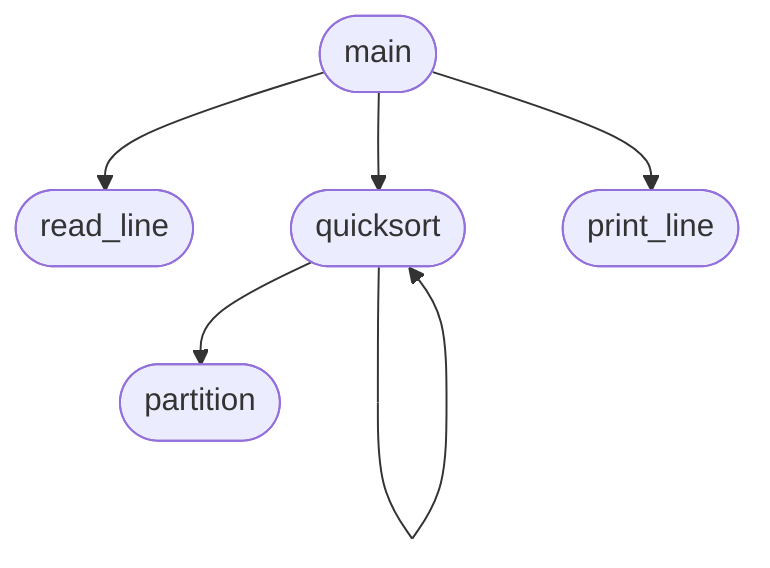
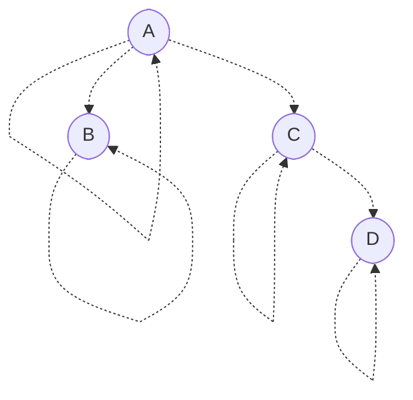
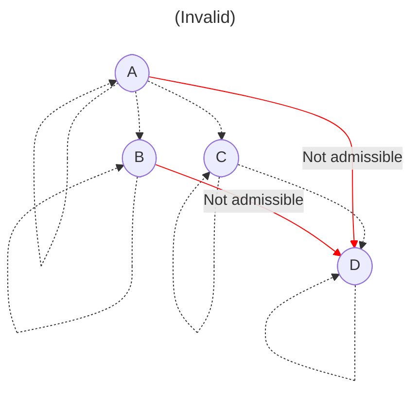
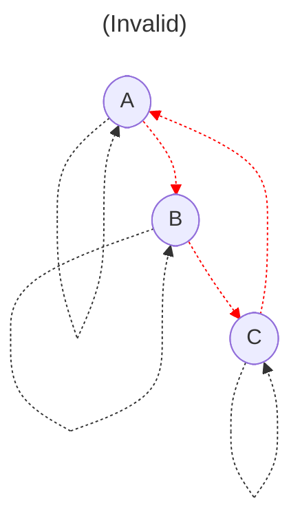
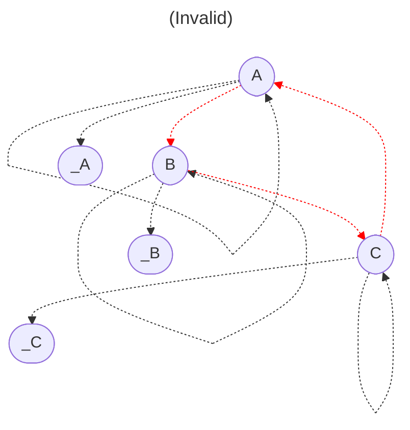
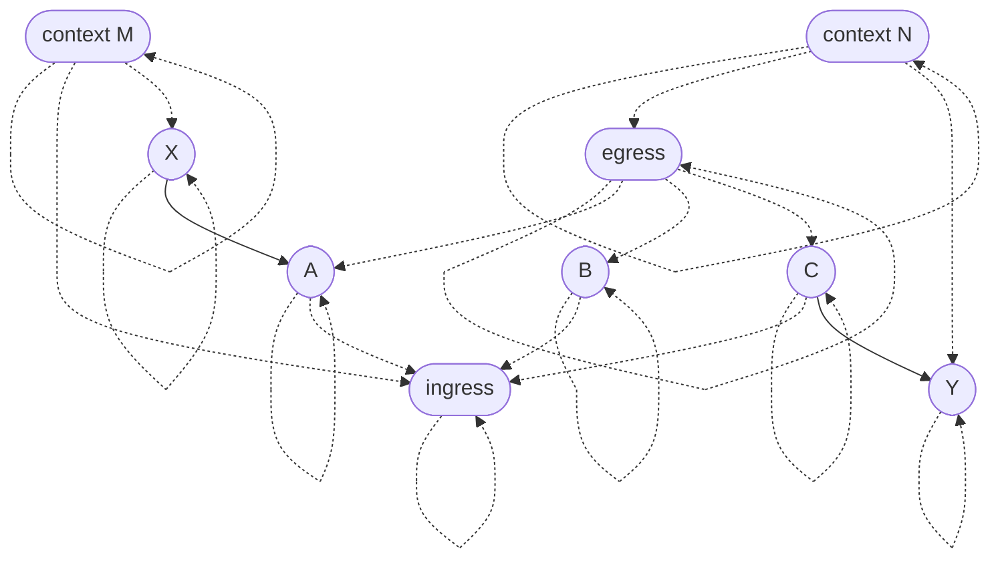

# Admissibility graphs

The theory of *admissibility graphs* is a general mathematical framework for specifying encapsulation boundaries in a system. This directory contains a formalization of the concept and [mechanized proofs](https://en.wikipedia.org/wiki/Proof_assistant) of some basic theorems about it. Below is an informal introduction to the idea. I hope you find it interesting!

## Motivation

Imagine a simple sorting program that reads in some lines of text and prints them out in lexicographical order. A [static call graph](https://en.wikipedia.org/wiki/Call_graph) for that program might look as follows:



For encapsulation purposes, we may wish to decree that `partition` is an implementation detail of `quicksort` and should not be called from any other function. In other words, we want to forbid any edges to `partition` in the call graph except the one from `quicksort`. How should a programmer express a policy like that?

Of course, most programming languages already have a mechanism for information hiding—if not several! For example, [scoping](https://en.wikipedia.org/wiki/Scope_\(computer_science\)) allows a programmer to write local definitions which are only accessible to part of the program. Object-oriented programmers may also think of [access modifiers](https://docs.oracle.com/javase/tutorial/java/javaOO/accesscontrol.html) like `public`, `private`, and `protected`, or the concept of "[friend classes](https://en.cppreference.com/w/cpp/language/friend)" in C++. Functional programmers may think of [module systems](https://jozefg.bitbucket.io/posts/2015-01-08-modules.html) or [existential quantification](https://groups.seas.harvard.edu/courses/cs152/2014sp/lectures/lec17-existential.pdf). Are all these language features particular instances of a more general theory? I will attempt to answer this question in the affirmative by introducing a theory of *admissibility graphs*.

As abstract mathematical objects, admissibility graphs are not specifically about encapsulation in computer programs. For example, a cloud computing provider might consider using admissibility graphs as a form of [identity and access management](https://en.wikipedia.org/wiki/Identity_management), a network engineer might use an admissibility graph to specify firewall policies, or a document collaboration application might use admissibility graphs to represent sharing settings.

## Definition

Before we look at any particular admissibility graphs, allow me to first define the general concept.

### Data

An admissibility graph, like any [graph](https://en.wikipedia.org/wiki/Graph_\(discrete_mathematics\)), has a set of **nodes**. The nodes might represent entities such as functions or modules in a program.

Admissibility graphs have two types of directed edges which are understood as [binary relations](https://en.wikipedia.org/wiki/Binary_relation) on nodes:

- **Links** are the main edges of the graph. They might represent associations like functions referencing other functions or modules importing other modules in a program. A link is depicted as a solid arrow from a *source* node to a *target* node.

  ```mermaid
  ---
  title: Link
  ---
  flowchart LR
    source([source])
    target([target])

    source --> target
  ```

  A node can link to multiple targets and be linked to from multiple sources.
- **Parent-child relationships**, as we'll soon see, organize the nodes in a way that specifies which links are allowed to exist. A parent-child relationship is depicted as a dotted arrow from a *parent* node to a *child* node.

  ```mermaid
  ---
  title: Parent-child relationship
  ---
  flowchart LR
    parent([parent])
    child([child])

    parent -.-> child
  ```

  Informally speaking, the children of a node are considered implementation details of that node. A node can have multiple parents and multiple children.

### Ancestry and admissibility

Before we can state the axioms, we must first define *ancestry* and *admissibility*.

- *Ancestry* is the [transitive closure](https://en.wikipedia.org/wiki/Transitive_closure) of the parent-child relation. We'll postulate below that the parent-child relation is [reflexive](https://en.wikipedia.org/wiki/Reflexive_relation), so ancestry is reflexive as well. All told, `A` is an *ancestor* of `D` (`D` is a *descendant* of `A`) when there is a path from `A` to `D` consisting of parent-child relationships.
- A node `T` *admits* a node `S` (`S` is *admitted by* `T`) when there is an ancestor `A` of `S` and a descendant `D` of `T` such that `A` is a parent of `D` (`D` is a child of `A`). A link is *admissible* when its target admits its source. Admissibility might seem mysterious at first, but we'll come to understand it through examples below.

### Axioms

Admissibility graphs are required to satisfy three mathematical laws:

- **Axiom (reflexivity).** Every node is a parent of itself.
- **Axiom (antisymmetry).** If two nodes are ancestors of each other, then they're the same node.
- **Axiom (admissibility).** Every link is admissible.

## Examples

To explore the consequences of the axioms and build intuition for them, let's take a look at several examples. You're invited to independently verify whether the graphs below agree with the axioms or violate them in some way.

### Admissibility basics

Let's take a look at this admissibility graph:



Every node is a parent of itself, per the reflexivity axiom. This can be interpreted as saying that every node is an implementation detail of itself. This may seem like a philosophical position, but we'll see [later](#special-cases-of-admissibility) that it has important practical consequences.

There are no ancestry cycles, per antisymmetry. That axiom may seem limiting, but we'll see that doesn't prevent nodes from mutually linking to each other. The motivation for antisymmetry will become clear [later](#the-module-pattern).

In this example, `B` and `C` are considered implementation details of `A`, and `D` is an implementation detail of `C`. What links would be admissible in this graph?

First, every node is admitted by its own implementation details. So links from `A` to `B` and `C` are admissible, and a link from `C` to `D` would be admissible too. [Loops](https://en.wikipedia.org/wiki/Loop_\(graph_theory\)) are also admissible, thanks to reflexivity.


Furthermore, the nodes corresponding to implementation details of another node mutually admit each other. So `B` and `C` can link to each other, since they are both children of `A`.


However, links from `A` or `B` to `D` would *not* be admissible, because `D` is a implementation detail of `C`.



### The module pattern

We'd like to be able to group nodes together and treat them as a single unit from an admissibility perspective.

If we didn't have the antisymmetry axiom, we might try to arrange them in an ancestry cycle:



This would accomplish the goal, however it has a crucial limitation. Suppose `A`, `B`, and `C` have implementation details `_A`, `_B`, and `_C`, respectively.



The problem is that the internal nodes `_A`, `_B`, and `_C` admit every node in the graph! The antisymmetry axiom says we shouldn't have ancestry cycles, since they're incompatible with encapsulation.

So what do we do instead? We can use the *module pattern*. We introduce auxiliary nodes to manage ingress and egress, and we configure them as follows:


Then the ingress node can be placed in contexts where we want the contents of the module to admit other nodes, and the egress node can be placed in contexts where we want the contents of the module to be admitted by other nodes.



It's natural to wonder whether a single node could serve as both the ingress and egress nodes for the same module. Unfortunately, that would violate antisymmetry.

## Special cases of admissibility

The admissibility axiom states that the target of a link must be an ancestor of a child of an ancestor of the source. In this section, we consider two common special cases of that criterion.

### Ancestors of children

A consequence of the admissibility axiom is that *a node is admitted by any ancestors of its children*. From this, we can draw many conclusions:

- A node is admitted by its own children.
- A node is admitted by parents of its children, including itself.
- A node is admitted by grandparents of its children, including its own parents.
- …
- A node is admitted by its own ancestors.

The second conclusion would seem to imply that admissibility is reflexive, which might make one wonder why the reflexivity axiom is needed. The complication is that this conclusion only follows when the node has children. The reflexivity axiom says it doesn't matter—every node has at least one child (itself).

### Children of ancestors

Another consequence of the admissibility axiom is that *a node is admitted by any children of its ancestors*. From this, we can also draw many conclusions, including some we've already seen:

- A node is admitted by its own children.
- A node is admitted by children of its parents (siblings), including itself.
- A node is admitted by children of its grandparents ([piblings](https://www.dictionary.com/e/aunt-uncle-niece-nephew-words/)), including its own parents.
- …
- A node is admitted by its own ancestors.

As before, the second conclusion seems to imply that admissibility is reflexive, but that only follows when the node has parents. The reflexivity axiom says it doesn't matter—every node has at least one parent (itself).
