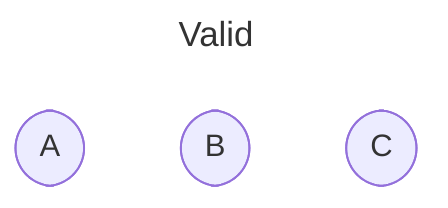
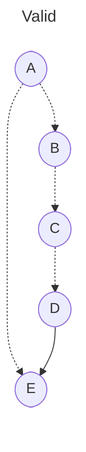

# Admissibility graphs

The theory of *admissibility graphs* is a general mathematical framework for precisely and concisely specifying encapsulation boundaries in a system. I developed this theory for a particular project, but I think it's interesting and general enough to share. This directory contains a formalization of the concept and [mechanized proofs](https://en.wikipedia.org/wiki/Proof_assistant) of some basic theorems about it. This document is an informal introduction to the idea.

## Motivation

Imagine a simple sorting program that reads in some lines of text and prints them out in lexicographical order. A simplified [static call graph](https://en.wikipedia.org/wiki/Call_graph) for that program might look as follows:


For encapsulation purposes, you may wish to decree that `partition` is an implementation detail of `quicksort` and should not be called from any other function. Equivalently, you'd like to forbid any edges to `partition` in the call graph except the one from `quicksort`. How should a programmer express that?

Of course, most programming languages already have a mechanism for information hiding—or several! For example, [scoping](https://en.wikipedia.org/wiki/Scope_\(computer_science\)) allows a programmer to write local definitions which are only accessible to part of the program. Object-oriented programmers may also think of [access modifiers](https://docs.oracle.com/javase/tutorial/java/javaOO/accesscontrol.html) like `public`, `private`, and `protected`, or the concept of "[friend classes](https://en.cppreference.com/w/cpp/language/friend)" in C++. Functional programmers may think of [module systems](https://jozefg.bitbucket.io/posts/2015-01-08-modules.html) or [existential quantification](https://groups.seas.harvard.edu/courses/cs152/2014sp/lectures/lec17-existential.pdf). The theory of admissibility graphs suggests a new way of understanding such language features by identifying what information the programmer should provide in order to specify encapsulation boundaries.

One might wonder why any innovation is needed at all. For the call graph example, it's easy to imagine an "access graph" with the same nodes, using edges in the access graph to indicate which edges should be allowed in the call graph. Then an edge in the call graph implies a corresponding edge in the access graph. Stated differently, the lack of an edge in the access graph demands the lack of an edge in the call graph. Unfortunately, this isn't very useful, since an access graph like that would be too large for a programmer to comfortably manage. For example, suppose some component of the program consists of 10 functions which should all be able to call each other. Then the access subgraph for those functions would have 10² = 100 edges, and introducing a new function would require adding 11² - 10² = 21 new access edges! The programmer shouldn't have to specify this much data to encode an intention as mundane as "unrestricted mutual access". An admissibility graph, which I'll define below, represents this information more economically. Our thesis is that admissibility graphs are sufficiently expressive to straightforwardly encode the access restriction patterns that arise in practice.

As abstract mathematical objects, admissibility graphs are not specifically about computer programs. For example, a cloud computing provider might consider using admissibility graphs as a form of [IAM](https://docs.aws.amazon.com/IAM/latest/UserGuide/access_policies.html) configuration. However, I'll stick to the theme of encapsulation in computer programs for our examples.

## The definition

Before we look at any particular admissibility graphs, allow me to first define the abstract concept.

### The data

An admissibility graph, like any [graph](https://en.wikipedia.org/wiki/Graph_\(discrete_mathematics\)), has a set of **nodes**. The nodes might represent entities such as functions or modules in a program.

An admissibility graph has two types of directed edges which are understood as separate [binary relations](https://en.wikipedia.org/wiki/Binary_relation) on nodes:

- **References** are the main edges of the graph. They might represent associations like functions referencing other functions or modules importing other modules in a program. A reference is depicted as a solid arrow from a *source* node to a *target* node.

  ```mermaid
  ---
  title: Reference
  ---
  flowchart LR
    source([source])
    target([target])

    source --> target
  ```

- **Parent-child relationships**, as we'll soon see, organize the nodes in a way that specifies which references are allowed to exist. A parent-child relationship is depicted as a dotted arrow from a *parent* node to a *child* node.

  ```mermaid
  ---
  title: Parent-child relationship
  ---
  flowchart LR
    parent([parent])
    child([child])

    parent -.-> child
  ```

### The axioms

We impose a couple of requirements on admissibility graphs. Before we get to them, we must first define the following:

- *Ancestry* is the [reflexive](https://en.wikipedia.org/wiki/Reflexive_closure) [transitive closure](https://en.wikipedia.org/wiki/Transitive_closure) of the parent-child relation. In other words, `A` is an *ancestor* of `D` (`D` is a *descendant* of `A`) when there is a (possibly empty) path from `A` to `D` consisting of parent-child relationships. In English, "ancestry" is not typically thought of as being a reflexive relation, but for technical reasons we define it as such.
- A hypothetical reference from a source `S` to a target `T` is *admissible* when there exists an ancestor `A` of `S` and a descendant `D` of `T` such that `A` is a parent of `D` (`D` is a child of `A`).

Now, the axioms:

- **Antisymmetry:** If two nodes are ancestors of each other, then they're the same node.
- **Admissibility:** Every reference is admissible.

The [antisymmetry](https://en.wikipedia.org/wiki/Antisymmetric_relation) axiom simplifies reasoning about the graph without any loss of generality. It implies that ancestry is a [partial order](https://en.wikipedia.org/wiki/Partially_ordered_set), or equivalently that the parent-child relationships induce a [directed acyclic subgraph](https://en.wikipedia.org/wiki/Directed_acyclic_graph). Note that antisymmetry only applies to ancestry (and thus parent-child relationships), not to references.

The admissibility axiom enforces encapsulation boundaries in the graph. The definition of admissible might seem obtuse, but we'll come to understand it through examples below.

## Examples

### Trivial admissibility graphs

The simplest possible admissibility graph has no nodes, and thus no references or parent-child relationships. Furthermore, any admissibility graph with no references and no parent-child relationships trivially satisfies the axioms.



### Self-references

The following is not a valid admissibility graph:


The problem is that `A` references itself, but the reference is not admissible. In other words, we have not given `A` permission to reference itself. To fix it, we need to give `A` a parent. Any parent will do, including `A` itself.


### Parents and children

The following is not a valid admissibility graph:


The reference from `A` to `B` is not admissible. We can fix that by making `A` a parent of `B`.


Perhaps surprisingly, we can instead make `B` a parent of `A`.


From this example, we can see that parents can reference their children, and children can reference their parents.

### Ancestral cycles

In the previous example, we encountered a problem that could be fixed by adding a parent-child relationship between two nodes in either direction. But we better not make `A` and `B` parents of each other, since that would violate antisymmetry.


Any longer cycles in parent-child relationships are also forbidden by antisymmetry:


### Grandparents and grandchildren

What about grandparents?


Grandchildren are allowed to reference grantparents. However, the converse is not true in general.


### Siblings

Consider this arrangement of a parent with two children:


From this example, we can see that siblings can reference each other.

Flipping the arrows around results in another valid admissibility graph.


From this, we can see that the parents of a node can reference each other as well.

### Niblings

The following is not a valid admissibility graph:


The reference from `B` to `D` is not admissible.

From this example, we can see that nodes don't have automatic access to their [niblings](https://www.merriam-webster.com/words-at-play/words-were-watching-nibling) (children of siblings), since they are considered implementation details of their parents.

### Piblings

Consider the following admissibility graph:


From this example, we can see that nodes can reference their [piblings](https://www.dictionary.com/e/aunt-uncle-niece-nephew-words/) (siblings of parents).

Furthermore, the following is accepted:



So nodes can reference the siblings of any of their ancestors, not just those of their parents.
