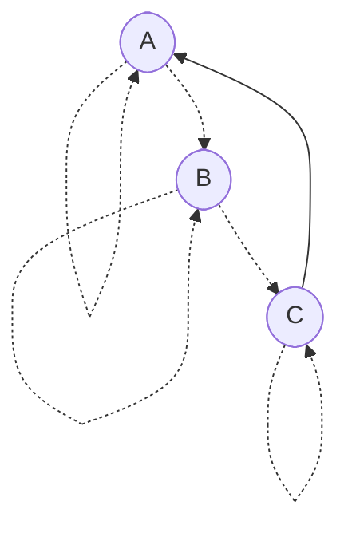

# Admissibility graphs

The theory of *admissibility graphs* is a general mathematical framework for specifying encapsulation boundaries in a system. This directory contains a formalization of the concept and [mechanized proofs](https://en.wikipedia.org/wiki/Proof_assistant) of some basic theorems about it. Below is an informal introduction to the idea. I hope you find it interesting!

## Motivation

Imagine a simple sorting program that reads in some lines of text and prints them out in lexicographical order. A [static call graph](https://en.wikipedia.org/wiki/Call_graph) for that program might look as follows:


For encapsulation purposes, we may wish to decree that `partition` is an implementation detail of `quicksort` and should not be called from any other function. In other words, we want to forbid any edges to `partition` in the call graph except the one from `quicksort`. How should a programmer express a policy like that?

One can imagine an "access graph" with the same nodes as a call graph, with edges in the access graph indicating which edges should be allowed in the call graph. Unfortunately, this notion isn't very useful as a specification language, since an access graph like that would be too large for a programmer to comfortably manage. For example, suppose some component of the program consists of 10 functions which should all be able to call each other. Then the access subgraph for those functions would have 10² = 100 edges, and introducing a new function would require adding 11² - 10² = 21 new access edges! A programmer shouldn't have to provide this much data to encode an intention as mundane as "unrestricted mutual access", and with such a low-level configuration it would be too easy to make a mistake. We're aiming for a more economical and less error-prone way to draw encapsulation boundaries.

Of course, most programming languages already have a mechanism for information hiding—if not several! For example, [scoping](https://en.wikipedia.org/wiki/Scope_\(computer_science\)) allows a programmer to write local definitions which are only accessible to part of the program. Object-oriented programmers may also think of [access modifiers](https://docs.oracle.com/javase/tutorial/java/javaOO/accesscontrol.html) like `public`, `private`, and `protected`, or the concept of "[friend classes](https://en.cppreference.com/w/cpp/language/friend)" in C++. Functional programmers may think of [module systems](https://jozefg.bitbucket.io/posts/2015-01-08-modules.html) or [existential quantification](https://groups.seas.harvard.edu/courses/cs152/2014sp/lectures/lec17-existential.pdf). Are all these language features particular instances of a more general theory? I will attempt to answer this question in the affirmative.

As abstract mathematical objects, admissibility graphs are not specifically about encapsulation in computer programs. For example, a cloud computing provider might consider using admissibility graphs as a form of [identity and access management](https://en.wikipedia.org/wiki/Identity_management), a network engineer might use an admissibility graph to specify firewall policies, or an online document collaboration application might use admissibility graphs to represent sharing settings.

## Definition

Before we look at any particular admissibility graphs, allow me to first define the general concept.

### Data

An admissibility graph, like any [graph](https://en.wikipedia.org/wiki/Graph_\(discrete_mathematics\)), has a set of **nodes**. The nodes might represent entities such as functions or modules in a program.

Admissibility graphs have two types of directed edges which are understood as [binary relations](https://en.wikipedia.org/wiki/Binary_relation) on nodes:

- **Links** are the main edges of the graph. They might represent associations like functions referencing other functions or modules importing other modules in a program. A link is depicted as a solid arrow from a *source* node to a *target* node.

  ```mermaid
  ---
  title: Link
  ---
  flowchart LR
    source([source])
    target([target])

    source --> target
  ```

  A node can link to multiple targets and be linked to from multiple sources.

- **Parent-child relationships**, as we'll soon see, organize the nodes in a way that specifies which links are allowed to exist. A parent-child relationship is depicted as a dotted arrow from a *parent* node to a *child* node.

  ```mermaid
  ---
  title: Parent-child relationship
  ---
  flowchart LR
    parent([parent])
    child([child])

    parent -.-> child
  ```

  Informally speaking, the children of a node are considered implementation details of that node. A node can have multiple parents and multiple children.

### Axioms

Admissibility graphs are required to satisfy some mathematical laws. Before we get to them, we must first define the following:

- *Ancestry* is the [transitive closure](https://en.wikipedia.org/wiki/Transitive_closure) of the parent-child relation. One of the axioms below will require the parent-child relation to be [reflexive](https://en.wikipedia.org/wiki/Reflexive_relation), so ancestry is reflexive as well. In other words, `A` is an *ancestor* of `D` (`D` is a *descendant* of `A`) when there is a path from `A` to `D` consisting of parent-child relationships.
- A hypothetical link from a source `S` to a target `T` is *admissible* when there exists an ancestor `A` of `S` and a descendant `D` of `T` such that `A` is a parent of `D` (`D` is a child of `A`). In other words, the link is admissible when the target is an ancestor of a child of an ancestor of the source.

Now we are ready to postulate the admissibility graph axioms:

- **(Admissibility)** Every link is admissible.
- **(Reflexivity)** Every node is a parent of itself.

The admissibility axiom enforces encapsulation boundaries in the graph. The definition of "admissible" might seem mysterious at first, but we'll come to understand it through examples below.

The reflexivity axiom ensures every hypothetical [loop](https://en.wikipedia.org/wiki/Loop_\(graph_theory\)) is admissible, which eliminates some awkward special cases that would complicate the theory.

## Examples

To explore the consequences of the axioms and build intuition for them, let's take a look at several examples. You're invited to independently verify whether the graphs below agree with the axioms or violate them in some way.

### Reflexivity

The simplest possible admissibility graph has no nodes, and thus no links or parent-child relationships. More generally, any admissibility graph with parent-child loops at every node and no links trivially satisfies the axioms. For example:


The following isn't a valid admissibility graph, since it violates the reflexivity axiom. It lacks a parent-child relationship from `A` to itself.


### Loops

Any node is allowed to link to itself.


### Parents and children

The following isn't a valid admissibility graph:


The problem is that the link from `A` to `B` isn't admissible. We can fix that by making `A` a parent of `B`.


Perhaps surprisingly, we can instead make `B` a parent of `A`.


So parents can link to their children, and children can link to their parents.

### Grandparents and grandchildren

Nodes can link to any of their ancestors, such as their grandparents.



However, the converse isn't true in general.


According to the above graph, `C` is an implementation detail of `B`, so the link from `A` to `C` isn't admissible.

### Siblings

Siblings can link to each other.


Flipping the arrows around in the above graph reveals that the parents of a node can link to each other as well.


### Niblings

Nodes don't have automatic access to their [niblings](https://www.merriam-webster.com/words-at-play/words-were-watching-nibling) (children of siblings).


In this example, the link from `B` to `D` isn't admissible, as `D` is considered an implementation detail of `C`.

### Piblings

Nodes can link to their [piblings](https://www.dictionary.com/e/aunt-uncle-niece-nephew-words/) (siblings of parents).


Furthermore, nodes can link to the children of any of their ancestors, not just those of their grandparents.


## Patterns

Here are some useful patterns that can be encoded in terms of admissibility graphs.

### Hide implementation details

To designate some node a private implementation detail of some other node, make the former a child of the latter.


### Shared implementation details

For nodes with shared private implementation details (such as when modeling C++ "friend classes"), encode the sharing directly with parent-child relationships.


### Treat a bunch of nodes as a single node

Nodes in an ancestry cycle are indistinguishable from an admissibility perspective. So if we want to treat a bunch of nodes identically, we just need to put them in a [strongly connected component](https://en.wikipedia.org/wiki/Strongly_connected_component). A simple way to do that is to introduce an auxiliary node as follows:


### Manage ingress and egresss for a group of nodes

This is the general configuration for a module. Upstream dependencies, i.e., nodes that the module wants to link to, should be added as children of the egress node. Downstream dependencies, i.e., nodes that want to link to the contents of the module, should be added as parents of the ingress node.

This configuration guarantees that the contents of the module cannot link to implementation details of upstream dependencies, and downstream dependencies cannot access implementation details of the contents of the module.


### Give one module access to another

To grant one module access to another, the egress node of one module should be made a parent of the ingress node of the other.


Mutual access can be granted by also hooking them up the other way.


