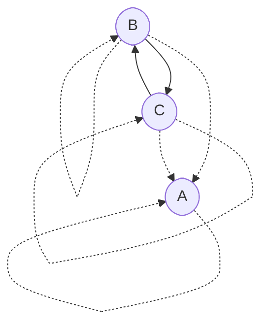

# Admissibility graphs

The theory of *admissibility graphs* is a general mathematical framework for precisely and concisely specifying encapsulation boundaries in a system. I developed this theory for a particular project, but I think it's versatile enough to be of independent interest. This directory contains a formalization of the concept and [mechanized proofs](https://en.wikipedia.org/wiki/Proof_assistant) of some basic theorems about it. This document is an informal introduction to the idea.

## Motivation

Imagine a simple sorting program that reads in some lines of text and prints them out in lexicographical order. A simplified [static call graph](https://en.wikipedia.org/wiki/Call_graph) for that program might look as follows:


For encapsulation purposes, you may wish to decree that `partition` is an implementation detail of `quicksort` and should not be called from any other function. Equivalently, you'd like to forbid any edges to `partition` in the call graph except the one from `quicksort`. How should a programmer express that?

Of course, most programming languages already have a mechanism for information hiding—or several! For example, [scoping](https://en.wikipedia.org/wiki/Scope_\(computer_science\)) allows a programmer to write local definitions which are only accessible to part of the program. Object-oriented programmers may also think of [access modifiers](https://docs.oracle.com/javase/tutorial/java/javaOO/accesscontrol.html) like `public`, `private`, and `protected`, or the concept of "[friend classes](https://en.cppreference.com/w/cpp/language/friend)" in C++. Functional programmers may think of [module systems](https://jozefg.bitbucket.io/posts/2015-01-08-modules.html) or [existential quantification](https://groups.seas.harvard.edu/courses/cs152/2014sp/lectures/lec17-existential.pdf). The theory of admissibility graphs suggests a new way of understanding such language features by identifying what information the programmer should provide in order to specify encapsulation boundaries.

It's easy to imagine an "access graph" with the same nodes as the call graph, using edges in the access graph to indicate which edges should be allowed in the call graph. Then an edge in the call graph implies a corresponding edge in the access graph. Stated differently, the lack of an edge in the access graph demands the lack of an edge in the call graph. Unfortunately, this isn't very useful, since an access graph like that would be too large for a programmer to comfortably manage. For example, suppose some component of the program consists of 10 functions which should all be able to call each other. Then the access subgraph for those functions would have 10² = 100 edges, and introducing a new function would require adding 11² - 10² = 21 new access edges! The programmer shouldn't have to specify this much data to encode an intention as mundane as "unrestricted mutual access". An admissibility graph, which I'll define below, represents access policies more economically. My thesis is that admissibility graphs are sufficiently expressive to straightforwardly encode the access restriction patterns that arise in practice.

As abstract mathematical objects, admissibility graphs are not specifically about computer programs. For example, a cloud computing provider might consider using admissibility graphs as a form of [IAM](https://docs.aws.amazon.com/IAM/latest/UserGuide/access_policies.html) configuration. However, I'll stick to the theme of encapsulation in computer programs for our examples.

## Definition

Before we look at any particular admissibility graphs, allow me to first define the general concept.

### Data

An admissibility graph, like any [graph](https://en.wikipedia.org/wiki/Graph_\(discrete_mathematics\)), has a set of **nodes**. The nodes might represent entities such as functions or modules in a program.

Admissibility graphs have two types of directed edges which are understood as [binary relations](https://en.wikipedia.org/wiki/Binary_relation) on nodes:

- **References** are the main edges of the graph. They might represent associations like functions referencing other functions or modules importing other modules in a program. A reference is depicted as a solid arrow from a *source* node to a *target* node.

  ```mermaid
  ---
  title: Reference
  ---
  flowchart LR
    source([source])
    target([target])

    source --> target
  ```

  A node can reference multiple nodes and be referenced by multiple nodes.

- **Parent-child relationships**, as we'll soon see, organize the nodes in a way that specifies which references are allowed to exist. A parent-child relationship is depicted as a dotted arrow from a *parent* node to a *child* node.

  ```mermaid
  ---
  title: Parent-child relationship
  ---
  flowchart LR
    parent([parent])
    child([child])

    parent -.-> child
  ```

  A node can have multiple parents and multiple children.

### Axioms

Admissibility graphs are required to satisfy some mathematical laws. Before we get to them, we must first define the following:

- *Ancestry* is the [reflexive](https://en.wikipedia.org/wiki/Reflexive_closure) [transitive closure](https://en.wikipedia.org/wiki/Transitive_closure) of the parent-child relation. In other words, `A` is an *ancestor* of `D` (`D` is a *descendant* of `A`) when there is a (possibly empty) path from `A` to `D` consisting of parent-child relationships. In English, ancestry isn't typically thought of as being a reflexive relation, but for technical reasons we define it as such.
- A hypothetical reference from a source `S` to a target `T` is *admissible* when there exists an ancestor `A` of `S` and a descendant `D` of `T` such that `A` is a parent of `D` (`D` is a child of `A`). In other words, the reference is admissible when `T` is an ancestor of a child of an ancestor of `S`.

Now we are ready to postulate the admissibility graph axioms:

- **Reflexivity:** Every node is a parent of itself.
- **Admissibility:** Every reference is admissible.

The [reflexivity](https://en.wikipedia.org/wiki/Reflexive_relation) axiom ensures every [loop](https://en.wikipedia.org/wiki/Loop_\(graph_theory\)) is admissible, which eliminates some awkward special cases that would complicate the theory.

The admissibility axiom enforces encapsulation boundaries in the graph. The definition of "admissible" might seem mysterious at first, but we'll come to understand it through examples below.

## Examples

To explore the consequences of the axioms and build intuition for them, let's take a look at several examples. You are invited to independently verify whether the graphs below agree with the axioms or violate them in some way.

### Reflexivity

The simplest possible admissibility graph has no nodes, and thus no references or parent-child relationships. Furthermore, any admissibility graph with parent-child loops on every node, no other parent-child relationships, and no references trivially satisfies the axioms.


The following isn't a valid admissibility graph, since it violates the reflexivity axiom. It lacks a parent-child relationship from `A` to itself.


### Self-references

Any node is allowed to reference itself.


### Parents and children

The following isn't a valid admissibility graph:


The problem is that the reference from `A` to `B` isn't admissible. We can fix that by making `A` a parent of `B`.


Perhaps surprisingly, we can instead make `B` a parent of `A`.


So parents can reference their children, and children can reference their parents.

### Grandparents and grandchildren

Grandchildren are allowed to reference their grantparents.


However, the converse isn't true in general.


According to the above graph, `C` is an implementation detail of `B`, so the reference from `A` to `C` isn't admissible.

### Siblings

Siblings can reference each other.


Flipping the arrows around in the above graph reveals that the parents of a node can reference each other as well.



### Niblings

Nodes don't have automatic access to their [niblings](https://www.merriam-webster.com/words-at-play/words-were-watching-nibling) (children of siblings).


In this example, the reference from `B` to `D` isn't admissible, as `D` is considered an implementation detail of `C`.

### Piblings

Nodes can reference their [piblings](https://www.dictionary.com/e/aunt-uncle-niece-nephew-words/) (siblings of parents).


Furthermore, nodes can reference the children of any of their ancestors, not just those of their grandparents.


### Cycles

Like parent-child relationships and references are allowed to form cycles.


## Patterns

Here are some useful patterns that can be encoded in terms of admissibility graphs.

### Hide implementation details

To make some node a private implementation detail of some other node, make the former a child of the latter.


### Shared implementation details

For nodes with shared private implementation details (such as when modeling C++ "friend classes"), encode the sharing directly with parent-child relationships.


### Give a bunch of nodes access to each other

To give a bunch of nodes access to each other, we can bundle them up into a module by giving them a common parent to manage ingress and a common child to manage egress.


Then, if we want to let some external node reference the nodes of the module, make it a parent of the ingress node.


Or, if we want to let all the module nodes access some external node, make the external node a child of the egress node.


We can use the same node for ingress and egress.

```mermaid
flowchart TD
  m([module])
  a([A])
  b([B])
  c([C])

  m -.-> m
  a -.-> a
  b -.-> b
  c -.-> c
  m -.-> a
  m -.-> b
  m -.-> c
  a -.-> m
  b -.-> m
  c -.-> m
```

### Many nodes accessing many nodes

Suppose we have two groups of nodes, with 3 nodes each, and we want the nodes in the first group to be able to reference nodes in the second group, but not vice versa. One might attempt the following:

```mermaid
flowchart TD
  a([A])
  b([B])
  c([C])
  x([X])
  y([Y])
  z([Z])

  a -.-> a
  b -.-> b
  c -.-> c
  x -.-> x
  y -.-> y
  z -.-> z
  a & b & c -.-> x & y & z
```

This isn't quite what we wanted, since we've unintentionally allowed all six nodes to reference each other. Another problem with this approach is that it doesn't scale. If we want to add a new node to one of the two groups, we'll also have to add many parent-child relationships. A better approach is to introduce an auxiliary node which liaises between the two sets of nodes.

```mermaid
flowchart TD
  l([liaison])
  a([A])
  b([B])
  c([C])
  x([X])
  y([Y])
  z([Z])

  l -.-> l
  a -.-> a
  b -.-> b
  c -.-> c
  x -.-> x
  y -.-> y
  z -.-> z
  l -.-> a
  l -.-> b
  l -.-> c
  x -.-> l
  y -.-> l
  z -.-> l
```

In this example, it is admissible for `A`, `B`, and `C` to reference `X`, `Y`, and `Z`, but not vice versa.
