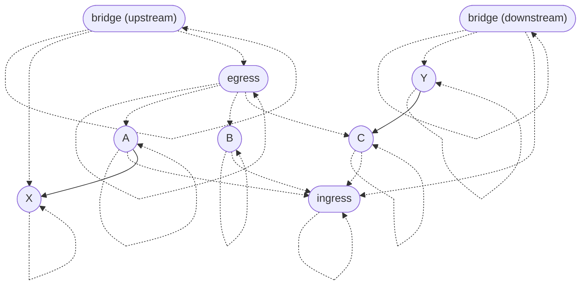
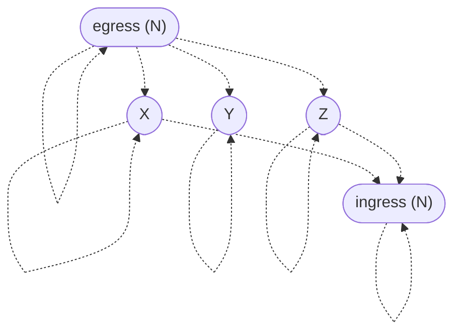

# Admissibility graphs

*Admissibility graphs* are a mathematical framework for specifying and enforcing [encapsulation](https://en.wikipedia.org/wiki/Encapsulation_\(computer_programming\)) boundaries in a system. This directory contains a formalization of the concept and [mechanized proofs](https://en.wikipedia.org/wiki/Proof_assistant) of some basic theorems about it. Below is an informal introduction to the idea. I hope you find it interesting!

## Motivation

Most programming languages have some support for [encapsulation](https://en.wikipedia.org/wiki/Encapsulation_\(computer_programming\)), such as [access modifiers](https://en.wikipedia.org/wiki/Access_modifiers) (`public`, `private`, etc.), [module systems](https://jozefg.bitbucket.io/posts/2015-01-08-modules.html), [existential types](https://groups.seas.harvard.edu/courses/cs152/2014sp/lectures/lec17-existential.pdf), and [closures](https://en.wikipedia.org/wiki/Closure_\(computer_programming\)). Encapsulation is a versatile concept in system design and isn't limited to just programming language features. For example, in a microservices architecture, it's common for a service to have its own database, with all access to that data being mediated by the service for the purposes of maintaining invariants and presenting a clear interface to downstream dependencies. In this tutorial, I'll introduce a general mathematical theory called *admissibility graphs* which can be used to model encapsulation in many different situations.

Time will tell how useful this concept ends up being, but I believe it sheds new light on the relationship between *dependencies* and *implementation details* and enables us to reason about these notions in a rigorous way.

## Definition

Before we look at any particular examples, allow me to first define the general concept.

### Data

An admissibility graph, like any [graph](https://en.wikipedia.org/wiki/Graph_\(discrete_mathematics\)), has a set of **nodes**. The nodes might represent entities such as functions in a program or microservices in a distributed system.

Admissibility graphs have two types of directed edges which are understood as [binary relations](https://en.wikipedia.org/wiki/Binary_relation) on nodes:

- **Dependencies** are arbitrary connections between nodes. For example, dependencies might indicate functions calling other functions or microservices making [RPCs](https://en.wikipedia.org/wiki/Remote_procedure_call) to other microservices. A node can depend on multiple *target* nodes and can be depended on by multiple *source* nodes. A dependency is depicted as a solid arrow from a source to a target.

  ```mermaid
  ---
  title: Dependency
  ---
  flowchart LR
    source([source])
    target([target])

    source --> target
  ```
- **Parent-child relationships** specify when nodes are considered to be encapsulated within other nodes. These relationships indirectly determine which dependencies are allowed between nodes. A node can have multiple *parent* nodes and multiple *child* nodes. A parent-child relationship is depicted as a dotted arrow from a parent to a child.

  ```mermaid
  ---
  title: Parent-child relationship
  ---
  flowchart LR
    parent([parent])
    child([child])

    parent -.-> child
  ```

### Ancestry and admissibility

Before we can state the axioms, we must first define *ancestry* and *admissibility*.

- *Ancestry* is the [transitive closure](https://en.wikipedia.org/wiki/Transitive_closure) of the parent-child relation. We'll postulate below that the parent-child relation is [reflexive](https://en.wikipedia.org/wiki/Reflexive_relation), so ancestry is reflexive as well. All told, `A` is an *ancestor* of `D` (`D` is a *descendant* of `A`) when there is a path from `A` to `D` consisting of parent-child relationships oriented parent-to-child.
- A node `T` *admits* a node `S` (`S` is *admitted by* `T`) when there is an ancestor `A` of `S` and a descendant `D` of `T` such that `A` is a parent of `D`. A dependency is *admissible* when the target admits the source. Admissibility might seem mysterious at first, but we'll come to understand it through examples below.

### Axioms

Admissibility graphs are required to satisfy three mathematical laws:

- **(Parent-child reflexivity)** Every node is a parent of itself.
- **(Ancestor antisymmetry)** No pair of distinct nodes are ancestors of each other.
- **(Dependency admissibility)** Every dependency is admissible.

The reasoning behind these axioms will be explained below.

## Examples

To explore the consequences of the axioms and build intuition for them, let's look at some examples. You're invited to independently verify whether the graphs below agree with the axioms or violate them in some way.

### Admissibility basics

Let's start with the following admissibility graph, which has some parent-child relationships but no dependencies.


First, we can check that the reflexivity and antisymmetry axioms are satisfied.

- Reflexivity says every node is a parent (and child) of itself. This can be interpreted as saying that every node is part of its own implementation. That may seem like a philosophical position, but we'll see [later](#special-cases-of-admissibility) that it has important practical consequences.
- Antisymmetry says there are no ancestry cycles other than the reflexivity loops. For example, `A` is an ancestor of `D`, so `D` can't be an ancestor of `A`. The motivation for antisymmetry will become clear [below](#a-first-attempt).

Now let's consider admissibility. In this example, `B` and `C` are considered implementation details of `A`, and `D` is an implementation detail of `C`. What dependencies could we add to this graph?

#### Nodes can depend on their children

Intuitively, a node should be able to depend on its implementation details. So, for every parent-child relationship, we can add a dependency on the child by the parent.


We should check that these dependencies are admissible. Recall:

> A node `T` *admits* a node `S` (`S` is *admitted by* `T`) when there is an ancestor `A` of `S` and a descendant `D` of `T` such that `A` is a parent of `D`. A dependency is *admissible* when the target admits the source.

In this case, let `A` = `S` and `D` = `T`, which is justified by reflexivity. Then the definition simply asks that the source is a parent of the target.

Going forward, I'll skip over the justification of each example, and trust that the reader can verify that the axioms are satisfied.

#### Siblings can depend on each other

Since `B` and `C` are both part of the implementation of `A`, they can depend on each other.


#### Nodes can depend on any nodes their parents can depend on

Since `C` is allowed to depend on `B`, the implementation of `C` should be allowed to depend on `B` as well. So `D` can depend on `B`.


#### Nodes can't depend on their [niblings](https://www.merriam-webster.com/words-at-play/words-were-watching-nibling) in general

Neither `A` nor `B` can depend on `D`, since `D` is an implementation detail of `C`.


### Modularity

We'd like to be able to group nodes together and manage them as a single unit from an admissibility perspective. For example, we might wish to allow a group of nodes to depend on another group of nodes, but not vice versa, and without quadratically many parent-child relationships. Is that possible?

#### A first attempt

If we didn't have the antisymmetry axiom, we could try to group nodes together by arranging them in an ancestry cycle:


This approach has a major flaw. Suppose `A`, `B`, and `C` have implementation details `_A`, `_B`, and `_C`, respectively.


The problem is that any node in this graph can depend on the implementation details of the other nodes! For example, `B` can depend on internal node `_A` since they are siblings, which doesn't match our expectation that `_A` is encapsulated within `A`. Ancestry cycles other than loops are incompatible with encapsulation, so the antisymmetry axiom rules them out.

But what should we do instead?

#### A proper module

We can arrange the nodes into a *module* by introducing gateway nodes to manage ingress and egress.


Then the egress gateway can be *bridged* with upstream nodes by giving them a common parent, and likewise the ingress gateway can be bridged with downstream nodes.



In this example, the upstream node `X` is a sibling of the egress gateway, so members of the module (e.g., `A`) can depend on it. The downstream node `Y` is a sibling of the ingress gateway, so it can depend on members of the module (e.g., `C`).

It's natural to wonder whether a single node could serve as both the ingress and egress gateways for the same module. That would violate antisymmetry. However, it's legal to bridge an external node with both the ingress and egress gateways of a module when both directions are needed.

#### Bridging modules

To allow the contents of one module to depend on the contents of another, we can bridge the egress gateway of the former and the ingress gateway of the latter:


In this example, the contents of module `M` can depend on the contents of module `N` (as demonstrated by the dependency on `X` by `C`), but not vice versa. Mutual admissibility can be arranged by also bridging the ingress of `M` and the egress of `N`, possibly using the same bridge as before. In general, arbitrary admissibility relationships between modules can be configured by bridging gateways.

#### Modular encapsulation

Suppose we want to make node `Y` a private implementation detail of module `N`, such that members of the other modules like `M` can't depend on it. We can simply disconnect `Y` from the ingress gateway of `N`.



## Special cases of admissibility

A dependency is admissible when the target is an ancestor of a child of an ancestor of the source. In this section, we consider two common special cases of that criterion.

### Ancestors of children

A consequence of the admissibility axiom is that *a node is admitted by any ancestors of its children*. From this, we can draw many conclusions:

- A node is admitted by its own children.
- A node is admitted by parents of its children, including itself.
- A node is admitted by grandparents of its children, including its own parents.
- …
- A node is admitted by its own ancestors.

The second conclusion would seem to imply that admissibility is reflexive, which might make one wonder why the reflexivity axiom is needed. The complication is that this conclusion only applies when the node has children. The reflexivity axiom says it doesn't matter—every node has at least one child (itself).

### Children of ancestors

Another consequence of the admissibility axiom is that *a node is admitted by any children of its ancestors*. From this, we can also draw many conclusions, including some we've already seen:

- A node is admitted by its own children.
- A node is admitted by children of its parents, including itself.
- A node is admitted by children of its grandparents, including its own parents.
- …
- A node is admitted by its own ancestors.

As before, the second conclusion seems to imply that admissibility is reflexive, but that only follows when the node has parents. The reflexivity axiom says it doesn't matter—every node has at least one parent (itself).

## Deciding admissibility

In this section, I'll describe an algorithm for deciding whether an admissibility graph is valid according to the three axioms. Let N be the number of nodes, let E be the number of parent-child relationships, and let D be the number of dependencies.

1. The *parent-child reflexivity* axiom is easy to verify by checking each node individually. This takes 𝒪(N) time and 𝒪(1) space.
2. Verifying the *ancestor antisymmetry* axiom amounts to detecting non-loop cycles in the graph induced by the parent-child relationships. This can be done by checking for back edges via depth-first search (DFS) in 𝒪(N + E) time and 𝒪(N) space. The search may need to be restarted at different starting nodes to cover the entire graph; this doesn't affect the asymptotic analysis.
3. To verify the *dependency admissibility* axiom, define an auxiliary graph as follows:

   - For every node N in the admissibility graph, the auxiliary graph will have two nodes N₁ and N₂.
   - For every parent-child relationship P → C, the auxiliary graph will have edges C₁ → P₁, C₂ → P₂, and P₁ → C₂.

   Then, to check that a dependency S → T is admissible, it suffices to check that T₂ is reachable from S₁ in the auxiliary graph. This can be done with DFS in 𝒪(N + E) time and 𝒪(N) space. If we traverse all the nodes T₂ reachable from some source S₁ (e.g., with a depth-first strategy), we discover all the nodes which admit that source, again in 𝒪(N + E) time and 𝒪(N) space. By doing this for every source S₁, we can discover all the admissible dependencies in the admissibility graph. Any dependencies which weren't discovered (which can be recorded by a hash table) aren't admissible. The total expected time complexity is 𝒪(N² + NE), and the worst-case space complexity is 𝒪(N + D).

So, determining whether an admissibility graph is valid can be done in 𝒪(N² + NE) expected time and 𝒪(N + D) space in the worst case.
